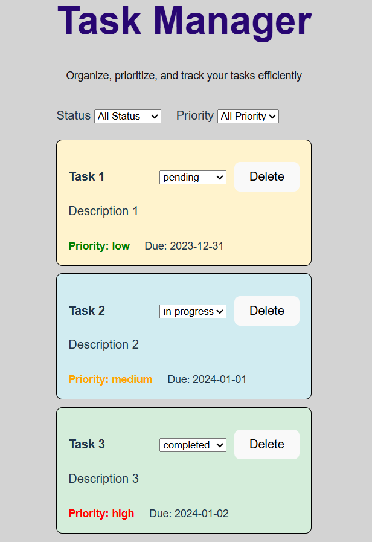

                                    Task Manager – React TypeScript Components
                                    -------------------------------------------
A fully functional Task Manager built with React and TypeScript using Vite.It allows you to view, filter, update, and delete tasks with conditional styling based on status and priority.

# Features

* Display a list of tasks with title, description, status, priority, and due date.

* Filter tasks by status (pending, in-progress, completed) and priority (low, medium, high)

* Update task status dynamically

* Delete tasks

* Conditional styling based on status and priority

# Installation Instructions

Follow these steps to set up and run the project locally:

1. Clone the Repository
  git clone 

2. Navigate to the Project Directory

   cd task-manager

3. Install Dependencies

Install all required packages using npm:

   npm install

   Alternatively, if you use Yarn, run:

   yarn install
4. Start the Development Server

   npm run dev

# Components Overview

1. TaskItem

  * Represents a single task.

  * Displays task details (title, description, status, priority, due date).

  * Dropdown to update task status.

  * Delete button.

  * Conditional styling based on status and priority.

2. TaskList

  * Renders a list of TaskItem components.

  * Maps over tasks with unique keys.

  * Receives callbacks for status updates and deletion.

3. TaskFilter

  Provides filtering functionality.

   * Filters by status and priority.

   * Calls a parent callback to update displayed tasks.

   4. ListManagement

4. Main component managing task state, filtering, and task actions.

  * Maintains task state using useState.

  * Handles status updates, deletion, and filtering.

  * Integrates TaskFilter and TaskList.

# Example Usage with Documentation

This section shows how to use the components and explains their interactions.

1. Main Component: ListManagement

   * Purpose:

       - Manages the list of tasks.

       - Handles status updates, deletion, and filtering.

       - Combines TaskFilter and TaskList.

* Usage Example:

import React from "react";
import { ListManagement } from "./components/ListManagment";

function App() {
  return (
    

      <h1>Task Manager</h1>
      <ListManagement />
    

  );
}

export default App;

* How it works:

 - Initializes tasks from taskData.ts.

 - Maintains task state and filters.

 - Updates task status or deletes a task using callbacks.

 - Passes filtered tasks to TaskList.

 2. Task Rendering: TaskList

* Purpose:

 - Renders TaskItem components.

 - Ensures each task has a unique key.

* Props:

  - tasks: array of tasks

  - onStatusChange: callback when status changes

  - onDelete: callback to delete task
* How it works:

   - Maps over tasks array and renders each TaskItem.

   - Calls parent callbacks for status updates and deletion.
   
3. Individual Task: TaskItem

  * Purpose:

      - Displays task details.

      - Allows status updates and deletion.

      - Applies conditional styling based on status.

  * Props:

       - task – task object

       - onStatusChange – callback for status updates

       - onDelete – callback for deletion

* How it works:

  - Renders task info in a card.

  - Dropdown updates the task state.

  - Delete button removes the task from the parent list.

  4. Filtering: TaskFilter

* Purpose:

  - Filters tasks by status or priority.

* Props:

  - onFilterChange – callback with selected filters

* How it works:

  - Renders two dropdowns (status & priority).

  - Calls onFilterChange on selection change.

  - ListManagement applies filters using useMemo.

  5. Putting It All Together

   * App Example:
   
import React from "react";
import { ListManagement } from "./components/ListManagment";

function App() {
  return (
    

      <h1>Task Manager</h1>
      <ListManagement />
    

  );
}

export default App;

# Flow:

- App initializes tasks.

- ListManagement manages task state.

- TaskFilter updates filters.

- TaskList renders filtered tasks.

- Each TaskItem allows status updates or deletion.

# Screenshot 
()

# Notes

 * All components are written in TypeScript with strict typing.

 * Task data is initially loaded from taskData.ts but can be replaced by an API or database.

 * State updates follow immutable patterns for safe React rendering.

 * Filtering, deletion, and status updates are fully dynamic and reactive.

 * Vite provides fast refresh, making UI updates instantaneous during development.

 